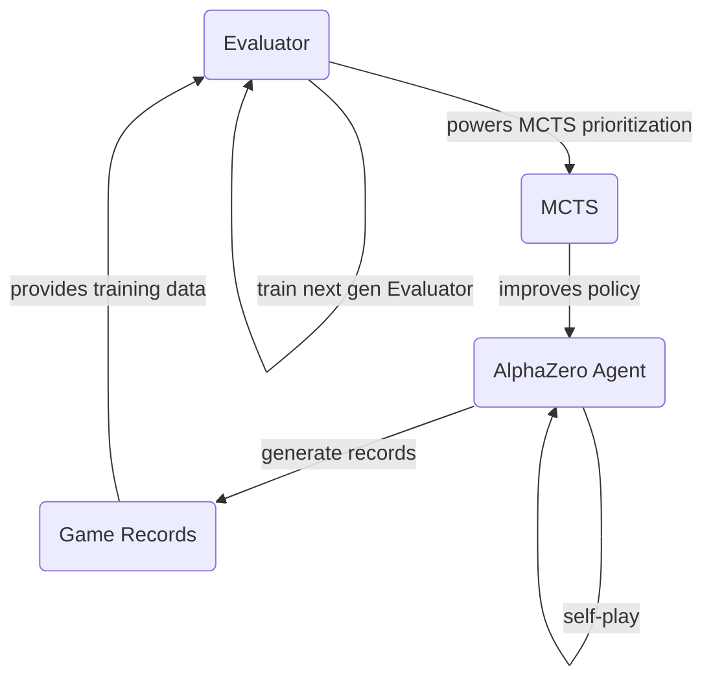
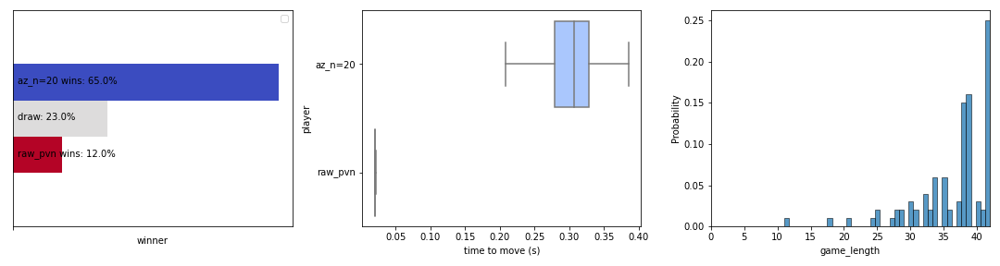
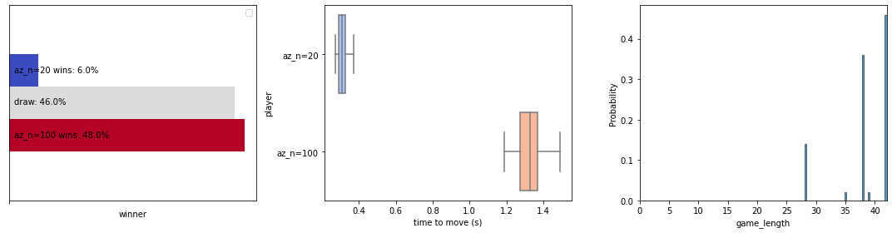
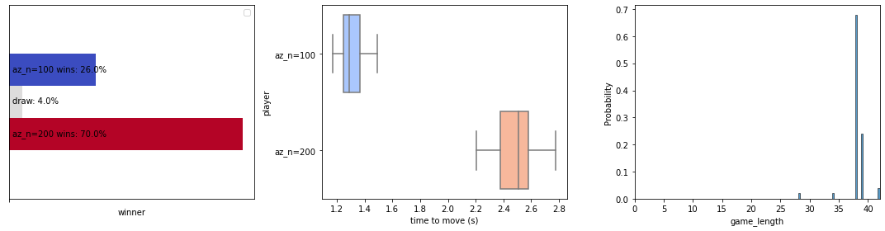
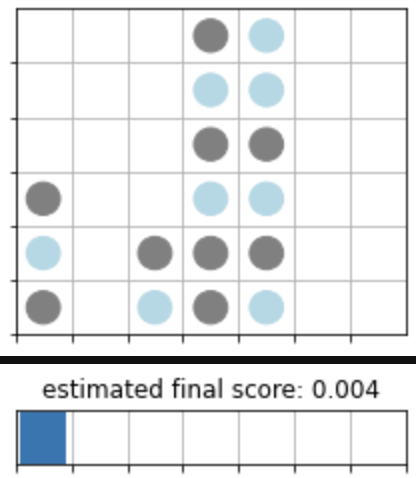
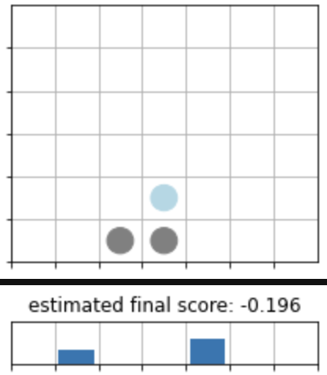

# ConnectFour x AlphaZero
*Hobby Project during my visa-related forced unpaid leave in spring 2020!!*
*Refactored in Spring 2022*

- AlphaGo Paper: https://arxiv.org/abs/1712.01815

## Goal: 
Train an agent to play **Connect 4** using a strategy similar to **AlphaGo Zero**.

Instead of creating a brute-force mimimax strategy (exhaustive tree search + feature engineering), we adopt a less resource-intensive approach: **truncated tree search**.

## High Level training pipeline

 This strategy consists in:
- an evaluator predicting the probabilities for each possible next move to be the best action as well as the overall probability of winning for the next player. This evaluator is essentially based on a classic CNN architecture (lightweight ResNet with ~350k parameters) with 2 heads: a policy head with a softmax activation and a state value head with a sigmoid activation.
- a version of Monte-Carlo Tree Search that leverages this evaluator to prioritize the regions of the tree to explore further, and returns an improved policy compared to the original evaluator.  
- The evaluator is iteratively trained following batches of self-played games. 
- Training data is gathered for each state by using:
   - the improved policy output from MCTS for the policy head and
   - the final outcome of the game (-1,0,1) for the value head.
- Note: duplicate examples of the same state appearing in multiple games are consolidated by averaging the final outcomes and the improved policies.

## Install
Setup environment:  
`conda install -f environment.yaml`

Install the `connectfour` package with `pip`:  
place yourself in the root folder of this project and run `pip install .`

## Playing against the agent
You can play against an agent in the terminal by running the command:
``` 
> python3 play_vs_ai.py --temperature 1 --n_simulations 200 
```
* `--temperature` controls how greedily the agent selects what it estimates the best move (lower is more greedy)
* `--model_path` controls the version of the agent to play against (currently defaults to `models/gen9.h5`, a model trained for 9 generations)
* `--n_simulations` controls the number of MCTS simulations to improve the policy before selecting the next move.

Personally, i haven't been able to beat `gen9` with low temperature and 400 simulations. :)

## Evaluating Competing Strategies
Agents with various strategies are compared by playing against each other 50 or 100 games. Results are expressed in terms of % of games won, inference time and the distribution of the number of moves before the game ends.
### Raw Evaluator vs AlphaZero (MCTS + Evaluator)

**Findings**: even a small number of MCTS simulations provide a significant competitive advantage over using the raw evaluator direclty to select the next action.
### Influence of number of simulations


**Findings**: as expected, the higher the number of simulations, the stronger the Agent. Marginal gains remain important even when going from 200 to 400 simulations.

## Example of policy inferences for a given state
| state and output policy | comments |
|:-------------------------:|:-------------------------:|
|| in this example, the blue player correctly identifies that playing in the first column is absolutely necessary to avoid losing 5 turns later. |   
|| similarly, the agent playing as grey identifies here the risk of losing in the next 4 turns if it does not prevent the opponent to form an open-ended 3-in-a-row horizontal line. it also identifies the slighlty higher value of playing column 5 in order to benefit from its position closer to the center.|

## Some Very Valuable Readings
- [lessons from implementing alphazero](https://medium.com/oracledevs/lessons-from-implementing-alphazero-7e36e9054191)
- [MCTS in AlphaGoZero](https://medium.com/@jonathan_hui/monte-carlo-tree-search-mcts-in-alphago-zero-8a403588276a)  
The former explains some implementation details and offers insights into good hyper-parameters to fine-tune a model for Connect Four:  
- **Self-play$MCTS$:**|
    - $c_{puct} = 4$ : coefficient for the $U(s,a)$ value for the PUCT version of the UCB value.
    - $\alpha = 1$: Dirichlet distribution parameter defining the level of noise introduced into the prior probability for actions from the root node (encouraging more epxloration)
    - $\tau = 1$: modifies the way the improved policy $\Pi$ is estimated. the higher $\tau$ is, the more flattened the policy distribution is going to get, promoting more exploration, but also leading to more frequent suboptimal moves. when $\tau$ tends to zero,
- **Policy Evaluator (Neural Network):**
    - Core Model:
        - Paper: ResNet 20 x 256 filters (24M params)
        - Original Implementation: ResNet 5 layers x 64 filters (386k parameters)
        - Later: ResNet 20 layers x 128 filters  (6.3M paramaters)
    - Value and Policy heads:
        - originally: resp. 1 and 2 filters
        - later: 32 filters
- **Generating Training Data:**
    - 7168 self-play games per generation (140K-220K game positions to evaluate)
    - 40 generations to plateau performance
    - training target for value head: average of $z$ and root node's $Q$ instead of only $z$.
    - position averaging: de-duplicate positions frequenty encountered in the training data and replace $Pi$ and $z$ with their averages.    
- **Training Pipeline**
    - sampling window: grows from 4 last gens to 20 last gens (after 35 epochs)
    - sample size: 500,000
    - epochs: 2 per generation
    - $lr$ learning rate: 1cycle learning rate
   
**STEPS:**
- [x] setup an environment to:  
  - [x] define state transitions
  - [x] define possible moves
  - [x] define game result
- [x] render states
- [x] create estimator: simple CNN with
    - [x] a policy head (softmax across 7 outputs)
    - [x] a value head estimate value of any state (between -1 and 1) > tanh
- [x] training:
    - [x] self-play for n games:
        - sample from potential moves, using estimator policy head distribution
        - perform MCTS to search the game space given a search "budget" (N evaluations, X seconds, ...) > needs to modify mctspy code: currently relies on random rollouts, no estimator / feature extractor to determine best moves.
    - [x] then: back-propagate final outcome of games (RL) > Vi, Qi
    - [x] use $V_i = Q_i + z$  and $\pi_i$ as labels to train estimator
    - [x] augmentation: use symmetry of the game to multiply by 2 the number of training samples generated by a single game.
